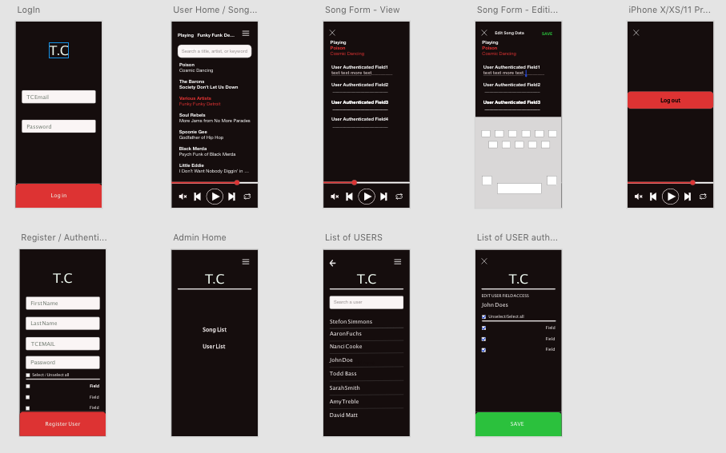
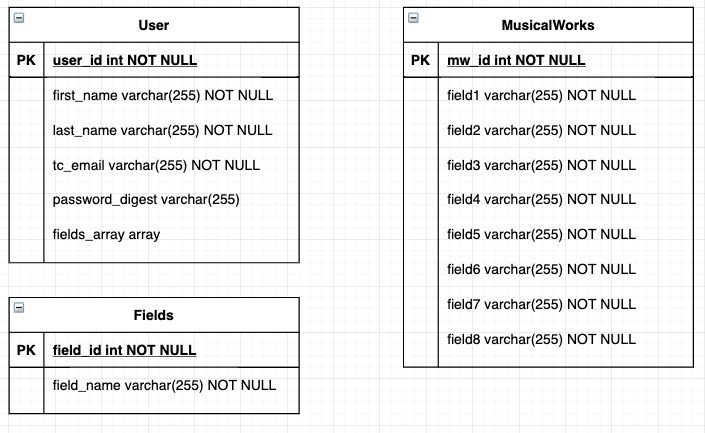

# Audio-Data-Tool

<br/>

- [Client](#Tuff-City-Records)
- [App Overview](#Tuff-City-App)
- [Libraries](#libraries)
- [MVP](#mvp)
  - [Goals](#goals)
  - [Client (Front End)](#client-front-end)
    - [Wireframes](#wireframes)
    - [Component Heirarchy](#component-heirarchy)
  - [Server (Back End)](#server-back-end)
    - [ERD Model](#erd-model)
  - [Time Estimates](#time-estimates)
- [Post-MVP](#post-mvp)
- [Code Issues & Resolutions](#code-issues--resolutions)

# Tuff-City-Records

Tuff City Records is a New York City-based label specializing in licensing and releasing rare and unreleased hip-hop, blues, funk, soul, R&B, latin and jazz on both vinyl and CD. Tuff City is the driving force behind a variety of specialty sub-labels including Ol' Skool Flava, Night Train, Funky Delicacies, Ovation Records, Andale, and Smokin' Music.
<br>

# Tuff-City-App
_An Internal Tool for Tuff City Records._

The software converts .xls and .xlsx files into JSON (javascript object notation), stores the data into a central database, and allows authenticated users the ability to create, read and update the fields of the central store. 

One of the main features for this software is the audio player. The audio player includes functionality for navigating to next or previous songs as well as putting a song on repeat. Users can update authorized fields while they listen to the track that they are editing.

The goal of the app is to develop a central store for the tuff city musical works so they can later export the data in the format specified by the recieving rights company, licensing company, digital distribution company, or Performance / Mechanical Rights Society.

<br>

# Libraries

|     Library          | Description                                |
| :--------------:     | :----------------------------------------- |
|      React           | _Javascript library used to develop the front-end (client)_  |
|   React Router       | _Used for establishing links and routes for front-end components_ |
|     Express          | _Express library used to develop the back-end server/api_ |
|     Axios            | _Used to make http requests from the front end_ |
|  Mongoose            | _MongoDB object modeling tool used build the schema and controllers_|
|  JSON Web Tokens     | _Used to encode and decode payload for user authentication_ |
|   bcrypt             | _Used to hash passwords on the backend._|
|  Styled Components   | _Used for writing CSS in react components vs a seperate stylesheet_|

<br>

# MVP

- Convert .xls and .xlsx sheets into JSON
- Bulk-create JSON data into Postgresql or MongoDB DB
- A RESTful 'Express.JS' app serving data to the frontend/client
- Deploy Backend to a cloud service heroku or aws
- Content (HTML) and styling (CSS) resembling the wireframes presented.
- Login and admin access to employee sign up
- User will be assigned permission to edit specific fields of a musical work.
- All site visitors can search through a list of musical works by keyword, song title or artist name
- Once logged in, the user can play a musical work while they edit the fields for it.

## Goals

Create a full-stack app with CRUD functionality and user authentication

<br>

## Client (Front End)

### Wireframes

Mobile View (via adobe)
- https://xd.adobe.com/view/70619d8d-08e3-4831-5e66-875d23e23507-0650/



### Component Hierarchy
```
src
|__ assets/
      |__ reset.css
|__ components/
      |__ LoginForm.jsx
      |__ RegisterForm.jsx
      |__ SongList.jsx
      |__ SearchBarSongs.jsx
      |__ SearchBarUsers.jsx
      |__ AudioPlayer.jsx
      |__ Song.jsx
      |__ EditFormModal.jsx
      |__ LogoutModal.jsx
      |__ AdminHome.jsx
      |__ UserList.jsx
      |__ UserProfile.jsx
      |__ ChangePassword.jsx
      |__ UploadSongs.jsx
|__ services/
      |__ apiConfig.js
      |__ auth.js
      |__ musicalWork.js
      |__ user.js
|__ App.jsx
|__ index.js

```
<br>

### Controllers

- createMWBulk
- createMusicalWork
- getMusicalWorks
- getMusicalWork
- updateMusicalWork
- login
- logout
- register (admin only)
- searchMusicalWork
- searchUsers

<br>

## Server (Back End)

### ERD Model
- https://drive.google.com/file/d/1MkmbfwAa_pxFlrpurxLzSreRmr3iA1q2/view 



<br>

### Server and DB Deployment Pricing

https://elements.heroku.com/addons/heroku-postgresql 

- Heroku $9/mo (Hobby Basic Plan) 
  - 10,000,000 row limit
  - 10 GB
- Heroku $50/mo (Standard Plan)
  - unlimted rows
  - 64 GB

## Time Estimates

| Task                               | Priority | Estimated Time | Time Invested | Actual Time |
| ---------------------------------- | :------: | :------------: | :-----------: | :---------: |
| Installing dependencies            |    H     |     15 mins    |     ----    |    ----     |
| App.jsx                            |    H     |     6 hrs      |     ----    |    ----     |
| LoginForm                          |    H     |     4 hrs      |     ----    |    ----     |
| RegiserForm                        |    H     |     4 hrs      |     ----    |    ----     |
| SongList                           |    H     |     5 hrs      |     ----    |    ----     |
| SearchBarSongs                     |    H     |     5 hrs      |     ----    |    ----     |
| SearchBarUsers                     |    L     |     5 hrs      |     ----    |    ----     |
| LogoutModal                        |    L     |     1 hrs      |     ----    |    ----     |
| AudioPlayer                        |    H     |     5 hrs      |     ----    |    ----     |
| Individual Songs                   |    H     |     3 hrs      |     ----    |    ----     |
| EditFormModal                      |    H     |     5 hrs      |     ----    |    ----     |
| AdminHome                          |    L     |     1 hrs      |     ----    |    ----     |
| UserList                           |    H     |     3 hrs      |     ----    |    ----     |
| UserProfile                        |    L     |     4 hrs      |     ----    |    ----     |
| Server/API (schema)                |    H     |     4 hrs      |     ----    |    ----     |
| Server/API (seed)                  |    H     |     2 hrs      |     ----    |    ----     |
| Server/API (MW_controllers)        |    H     |     4 hrs      |     ----    |    ----     |
| Server/API (user_controllers)      |    H     |     2 hrs      |     ----    |    ----     |
| Server/API (auth_controllers)      |    H     |     3 hrs      |     ----    |    ----     |
| Server/API (search_controllers)    |    H     |     2 hr       |     ----    |    ----     |
| Server/API (custom routes)         |    M     |     1 hrs      |     ----    |    ----     |
| SetUp/Connect DB                   |    H     |     4 hrs      |     ----    |    ----     |
| Deploy Backend and Frontend        |    H     |     5 hrs      |     ----    |    ----     |
| Styling/Responsive Design          |    H     |     10 hrs     |     ----    |    ----     |
| Debugging/Formatting Excel Data    |    H     |     3 hrs     |     ----    |    ----     |
| TOTAL                              |    --    |    91 hrs      |     ----    |    ----     |

<br>
***

# Post-MVP

- export data to a format specified by the recieving rights company, licensing company, digital distribution company, or Performance / Mechanical Rights Society.


# Code Issues & Resolutions

> This section lists all major issues encountered and their resolution. There are currently no major issues.
 
